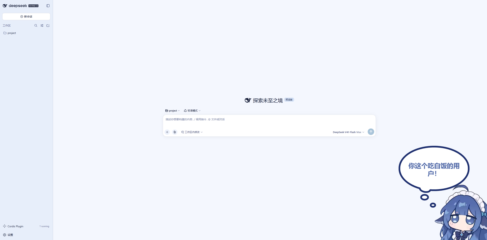
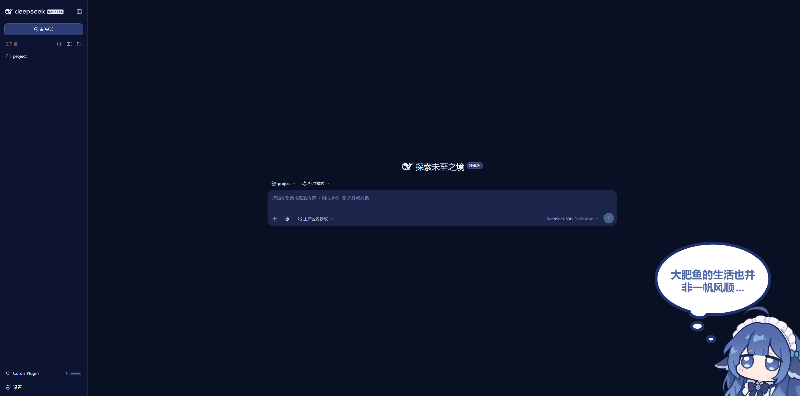
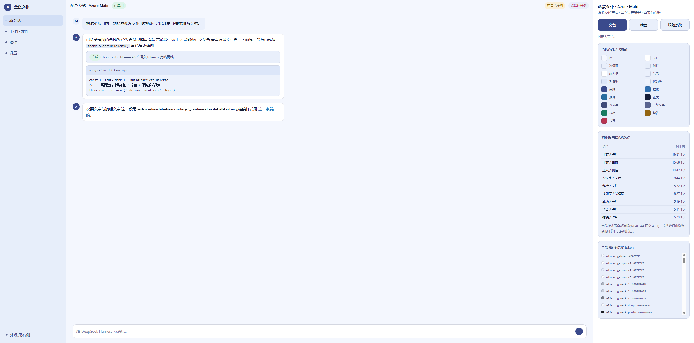
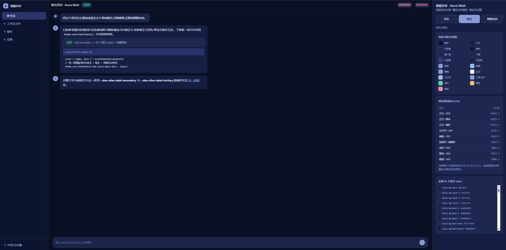

# 蓝瓷女仆 · Azure Maid

> 一个可以**跟随系统**切换深浅色的 DSH Web GUI 主题皮肤。
> 深蓝发色主调 · 蕾丝冷白提亮 · 青宝石点缀 —— 覆盖 90 个语义 token，亮暗各一套。

<p>
  
  
  
  
</p>
**先看一眼配色** → 直接用浏览器打开 [`preview/index.html`](preview/index.html)（无需安装、无需联网、无需构建）。
页面上有三个模式按钮，点一下就能看亮暗两套的实际观感，右下角还会用**浏览器真实计算出的值**实时算 WCAG 对比度。

---

## 目录

- [它长什么样](#它长什么样)
- [配色从哪里来](#配色从哪里来)
- [挂件来源与致谢](#挂件来源与致谢)
- [快速开始](#快速开始)
- [安装](#安装)
- [三种外观偏好是怎么实现的](#三种外观偏好是怎么实现的)
- [色值是怎么流转的](#色值是怎么流转的)
- [改配色](#改配色)
- [自检](#自检)
- [仓库结构](#仓库结构)
- [常见问题](#常见问题)
- [项目信息](#项目信息)
- [许可证](#许可证)

---

## 它长什么样

下面是**装上之后**的真实截图（同一个界面，左右分别是亮色与暗色）：

<table>
  <tr>
    <th align="center" width="50%">亮色</th>
    <th align="center" width="50%">暗色</th>
  </tr>
  <tr>
    <td></td>
    <td></td>
  </tr>
  <tr>
    <td align="center"><sub>冷白画布 + 浅蓝侧栏，正文深蓝</sub></td>
    <td align="center"><sub>深夜蓝画布，正文冷白</sub></td>
  </tr>
  <tr>
    <td></td>
    <td></td>
  </tr>
  <tr>
    <td align="center"><sub>色板、实时 WCAG 对比度、全部 90 个 token</sub></td>
    <td align="center"><sub>同一页在暗色下的取值</sub></td>
  </tr>
</table>

右下角那只蓝发女仆挂件不是本仓库的东西 —— 它是社区项目
[DeepSeek-Balance-Whale-Widget](https://github.com/MeteorNOX/DeepSeek-Balance-Whale-Widget)，
本皮肤正是从它的**挂件配色**取色而来，出处见[挂件来源与致谢](#挂件来源与致谢)。

还想要可交互的版本 → 用浏览器打开 [`preview/index.html`](preview/index.html)
（无需安装、无需联网、无需构建），三个模式按钮点一下就能切，右下角会用
**浏览器真实计算出的值**实时算 WCAG 对比度。

---

## 配色从哪里来

配色取自挂件的五个色域，每个色域在亮/暗两套里各占一个明度档 ——
**暗色不是"把亮色调暗"，而是同一个色域的另一个档位**，和同一束头发的高光与阴影关系一致：

| 色域 | 挂件取样 | 亮色档 | 暗色档 | 在界面里承担 |
| --- | --- | --- | --- | --- |
| 发色（主） | `#5568B0` `#6F82C8` `#8A9AD8` | `#3A4A8C` | `#8A9AD8` | 品牌色、按钮填充、强调 |
| 发影 | `#2A3568` `#39457F` | `#141C36` | `#E8EEFB`* | 正文、标题 |
| 提亮 / 蕾丝 | `#F2F6FF` | `#F4F7FE` `#FFFFFF` | `#0A1024`* | 画布、卡片、正文反色 |
| 发间青宝石 | `#3E8FC4` `#2F7FB8` | `#276C9F` | `#7FC0E8` | 链接、交互色、业务态 |
| 腮红 / 暖点 | `#F0B9BE` | `#B83551` | `#FF8598` | 错误、警示标签 |

\* 亮暗两套是"角色互换"而不是"整体调暗"：亮色下正文是深蓝、画布是冷白；暗色下正文是冷白、画布是深夜蓝。

上面那四张是**手工截的真机图**（连挂件一起截，能看出皮肤和挂件的搭配效果）。
如果你改过配色、想重新出一组，或者想要不带挂件、只有配色本身的对照图：

```bash
node scripts/preview.mjs          # 重新生成预览页（改配色后必跑）
node scripts/shoot-preview.mjs    # 可选：用本机浏览器给预览页拍图
```

`shoot-preview.mjs` 产出的是 `preview/light.png` 与 `preview/dark.png`
（注意与上面手工图的 `light1/light2/dark1/dark2` 是两套文件）。
这一步需要本机有 Chromium 系浏览器；没有就跳过，不影响插件本身。

---

## 快速开始

```bash
git clone https://github.com/<你的用户名>/dsh-azure-maid-skin.git
cd dsh-azure-maid-skin

npm run build        # 从 theme/palette.mjs 生成 lib/ 下的产物
npm run check        # 自检：token 清单 / 对比度 / 产物完整性 / 渲染冒烟
npm run preview      # 生成配色预览页（用浏览器打开 preview/index.html）
npm run make:dynamic # 可选：生成"当场验收"用的动态插件载荷
```

本包**没有运行时依赖**。`npm run build` 与 `npm run check` 只用 Node 内置模块，
不需要 `npm install`（`check` 里的设置页渲染用内置的 hook 替身完成 —— 装了真
`react` 时会自动改用真的）。

---

## 安装

DSH 的插件按 profile 挂载。把本包装进 `web` profile：

```bash
dsh plugin --profile web add link:/绝对路径/dsh-azure-maid-skin
```

或者手工改 `~/.dsh/profiles/web/package.json`：

```json
{
  "dependencies": {
    "dsh-azure-maid-skin": "link:/绝对路径/dsh-azure-maid-skin"
  },
  "dsh": {
    "profile": {
      "bundles": [
        "@deepseek-ai/dsh-base",
        "@deepseek-ai/dsh-web-app",
        "dsh-azure-maid-skin"
      ],
      "patchReload": "live"
    }
  }
}
```

然后重启 `dsh web`（或让 profile 热重载生效），刷新页面。

**停用而不卸载**：`dsh plugin --profile web remove dsh-azure-maid-skin`，或从
`dsh.profile.bundles` 里删掉包名后重启。样式与主题层都会随插件一起消失，
不会在别处留下残留。

**临时试一下**：不想改 profile 的话，可以生成一份动态插件的 Client 载荷，
贴进 DSH 的 Cordis 会话里当场看效果 —— 配色用的就是仓库里的真实值：

```bash
npm run make:dynamic     # 产出 tmp-dynamic/preview-client.js
```

把该文件内容作为 `code.client` 交给 Cordis 的 `define`，运行（客户端半边需要你
在界面上批准一次）。它会：
- 用和正式包**完全相同**的调用形状 `theme.overrideTokens(...)` 套上 180 个真实值；
- 在对话流里放一个面板，列出三种偏好按钮与 14 个关键槽位的实际色块。

这个载荷是**临时**的：只活在当前 DSH 进程里，重启即消失，也不改任何文件。
看够了就把那个动态插件停用或移除，配色完整还原。`tmp-dynamic/` 已在
`.gitignore` 里，不会被推上去。

---

## 三种外观偏好是怎么实现的

这是本包唯一需要解释的设计决定，因为"跟随系统"在 DSH 的主题体系里有个陷阱。

### 陷阱：注册两个主题 id 会让「跟随系统」掉回官方配色

主题服务的 `system` 偏好**只解析到内建的 `light` / `dark`**：

```js
// dsh-client-ui-theme 的 buildSnapshot()
const resolvedId = this.preference === 'system'
  ? (this.media?.matches === true ? 'dark' : 'light')
  : this.preference
```

也就是说，第三方 `theme.register({ id: 'azure-light' })` 注册出来的 id
**不参与 `system` 的解析**。如果按"两个主题"的思路做，用户在设置里一选
「跟随系统」就会掉回官方配色 —— 皮肤在三种偏好里只有两种生效。

### 做法：一层 `overrideTokens`，三种偏好通吃

主题服务提供了叠加层 API：

```js
theme.overrideTokens(source, {
  '--dsw-alias-bg-base': { light: '#F4F7FE', dark: '#0A1024' },
  // ... 90 个
})
```

它接收**成对的**亮/暗值，由主题服务按当前 `colorScheme` 选一套，并且不碰偏好本身。
于是：

| 用户偏好 | 主题服务解析出的 colorScheme | 本皮肤取到 | 结果 |
| --- | --- | --- | --- |
| 亮色 | `light` | 亮色档 | ✅ |
| 暗色 | `dark` | 暗色档 | ✅ |
| 跟随系统 | 由 `prefers-color-scheme` 决定 | 对应档 | ✅ **自动跟随，系统翻转时实时切换** |

所以本包**不注册任何主题 id**，只贡献一层覆盖。偏好切换仍然由 DSH 自己的
「设置 → 通用 → 外观」那三个方块负责，本包只是把自己的设置页也接到同一个写入口
（`theme.setTheme('light' | 'dark' | 'system')`）上，两边永远同步。

### 两半分工

| | 位置 | 职责 | 为什么需要它 |
| --- | --- | --- | --- |
| **Host 半边** | `lib/index.js` | 在 `<body>` 起始处注入 `lib/styles/azure-maid.css` | 客户端模块要等模块脚本执行完才生效，此前那一帧还是官方配色（深色偏好下会白闪一下）。这份样式表在 `<body>` 打开时就位，补上这个空档 |
| **Client 半边** | `lib/client.js` | `overrideTokens` 写入行内样式 + 设置页 | 行内样式优先级最高，且能跟随系统实时切换 |

首绘样式表在客户端接管后**自己让位**：客户端给 `<html>` 打上
`data-dsh-azure-maid-client`，样式表最后一条同特异性规则把 90 个 token 全部
`unset`。这样不需要任何 DOM 查询去找那个 `<link>`，少一处会和宿主结构耦合的地方。

---

## 色值是怎么流转的

三层结构，越往下越"只改一处"：

```
theme/palette.mjs     ← 颜色真源。所有十六进制值只在这里出现一次。
      ↓
theme/tokens.mjs      ← 语义映射：[token, [亮色角色, 暗色角色]]，共 90 条。
      ↓
scripts/build-tokens.mjs
      ↓
lib/tokens.js         ← Client 半边用的 { LIGHT, DARK }
lib/styles/azure-maid.css  ← Host 半边用的首绘样式表
      ↓
scripts/build-client.mjs  →  lib/client.js（把 token 内联进客户端模块）
```

90 个 token 的清单取自 DSH 设计基线样式表里 `--dsw-alias-*` 与 `--dsw-specific-*`
的声明（亮暗集合完全一致）。**不覆盖 `--dsw-static-*`** —— 那是设计基线的原始色阶，
改它等于改调色板本身；只覆盖语义层，DSH 升级换掉内部类名也不会让本包失效。

`npm run check:tokens` 会把本表与本机 DSH 的基线逐一对齐，多一个或少一个都报错 ——
这是一道"升级哨兵"：DSH 版本升级新增语义 token 时会立刻暴露，而不是等用户在界面上
看到某个角落还是官方配色才发现。

---

## 挂件来源与致谢

### 配色出处

本皮肤的配色**取样自下面这个项目的挂件**：

> **[MeteorNOX/DeepSeek-Balance-Whale-Widget](https://github.com/MeteorNOX/DeepSeek-Balance-Whale-Widget)**
> —— DSH 的余额/鲸鱼挂件，带一只蓝发女仆形象的看板娘。

上面截图右下角的那只挂件来自该项目。本仓库从它的**挂件配色**里取了五个色域
（见[配色从哪里来](#配色从哪里来)），再据此推导出 90 个 DSH 语义 token 的亮暗两套取值。

本项目是**取色灵感上的衍生**，与该项目之间：

- **不包含**其任何源码、素材或图片文件 —— 本仓库里没有一行代码或一张图片来自该项目；
- **不共享**其许可证 —— 本仓库代码按 [MIT](LICENSE) 授权；
- **不代表**该项目作者 —— 有问题请提到[本仓库的 Issues](https://github.com/erha2777/dsh-azure-maid-skin/issues)，
  不要去打扰上游作者。

如果想在界面上拥有截图里那只挂件本身，请直接安装上面那个项目 —— 本皮肤只负责配色，
两者可以同时装、互不冲突。

### 关于挂件形象的版权

挂件里的角色形象与美术资源,其权利归**原作者 / 上游项目**所有,本仓库不主张任何权利,
也没有随附或再分发这些素材。本皮肤仅仅是在**颜色层面**向它靠拢(用了相近的蓝色系、
冷白与青蓝点缀),不含任何角色形象本身。

如果你的目的是把这类角色美术用于再分发或商业场景,请自行向原作者确认授权 ——
MIT 许可证覆盖的是**本仓库的代码**,不覆盖第三方的角色形象。

### 致谢

- [MeteorNOX/DeepSeek-Balance-Whale-Widget](https://github.com/MeteorNOX/DeepSeek-Balance-Whale-Widget) —— 配色灵感与挂件来源
- [DeepSeek Harness](https://github.com/deepseek-ai) —— 主题服务提供了 `overrideTokens`
  这层叠加 API，才让"一层覆盖同时覆盖亮色/暗色/跟随系统"成为可能

---

## 改配色

1. 改 `theme/palette.mjs` —— 想换主色就改 `brand` / `accent`，想换底色就改 `canvas` / `surface`。
2. 跑 `npm run build` —— 重新生成 `lib/tokens.js`、`lib/styles/azure-maid.css`、`lib/client.js`。
3. 跑 `npm run check` —— 对比度不达标会直接失败并告诉你是哪一对、差多少。

架构上做了两件事让"改配色"不容易出错：

- **角色名拼错会立刻抛错**。`buildTokenSets()` 发现 `ROLE_MAP` 引用了 palette 里
  不存在的角色时直接报错，而不是静默产出一个坏颜色（那类错误在浏览器里表现成
  "某个角落颜色不对"，极难排查）。
- **亮暗必须真的不同**。`check:tokens` 会断言两档不是同一批值 ——
  拦的是"亮暗填了同一套值、切到暗色毫无反应"这类事故。

颜色值必须是 6 位或 8 位（带 alpha）的 sRGB 十六进制字面量，不写颜色函数 ——
这些值会被写进 `body` 的行内样式，必须字面可解析。

---

## 自检

```bash
npm run check
```

四个脚本，各自守一件事：

| 脚本 | 守什么 |
| --- | --- |
| `check-tokens` | 90 个 token 齐全、无重复、角色可解析、颜色字面量合法、亮暗两档确实不同；并与本机 DSH 设计基线逐一对齐 |
| `check-contrast` | 92 对真实的"前景 / 背景"组合按 WCAG AA 计算（正文 4.5:1、次要文字 3:1、描边与选中底色这类非文本要素 1.15:1）。带 alpha 的颜色按 sRGB 逐通道混合后再算 —— 浏览器就是这么渲染的 |
| `check-artifacts` | 重新构建一遍产物必须字节相同（拦"忘了 build"）；`lib/client.js` 形态与语法；**客户端与 CSS 两侧的 180 个值逐条对齐**（不一致会表现为"启动前后颜色跳一下"）；真加载一次客户端模块；真渲染一次设置页；停用时覆盖层必须被归还 |
| `check-preview` | 预览页的模式切换与对比度算法与仓库算法一致（包含在 `check-artifacts` 里） |

除此之外，构建脚本自己也会兜底：`build-client.mjs` 会用 `new Function()` 对
生成的产物做一次语法自检 —— 这条是踩过坑加上去的：早期版本生成出
`const TOKENS = var TOKENS = {...}` 这种语法错误，而当时的检查只看了 ESM 残留，
坏文件就被写进仓库了。

---

## 仓库结构

```
dsh-azure-maid-skin/
├── theme/
│   ├── palette.mjs          ← 颜色真源（唯一出现十六进制值的地方）
│   ├── tokens.mjs           ← 语义映射表 + buildTokenSets()
│   └── client-source.mjs    ← 客户端半边源码（ESM，不直接发布）
├── lib/                     ← 构建产物（已入库，方便直接安装）
│   ├── index.js             ← Host 半边：首绘样式表注入
│   ├── client.js            ← Client 半边：overrideTokens + 设置页
│   ├── tokens.js            ← { LIGHT, DARK }
│   └── styles/azure-maid.css
├── scripts/
│   ├── build-tokens.mjs     ├── build-client.mjs
│   ├── check-tokens.mjs     ├── check-contrast.mjs
│   ├── check-artifacts.mjs  ├── color.mjs
│   ├── preview.mjs          ├── shoot-preview.mjs
│   ├── make-dynamic.mjs     ← 生成"当场验收"用的动态插件载荷
│   ├── solve.mjs            ← 一次性调色求解器（挑"刚好达标"的颜色）
│   └── test-react-shim.mjs  ← 零依赖的 hook 替身，供渲染冒烟使用
├── preview/index.html       ← 自包含配色预览页
├── cordis.patch.yml         ← bundle 挂载声明
└── package.json
```

为什么 `lib/` 也入库：DSH 的 profile 用 `link:` 指向本目录时读的就是 `lib/`，
入库可以让 `git clone` 之后免构建直接用。`npm run check` 会保证它与源文件同步。

---

## 常见问题

**装上了但颜色没变？**
先确认插件真的挂上了：`~/.dsh/profiles/web/package.json` 的
`dsh.profile.bundles` 里有 `dsh-azure-maid-skin`，然后重启 `dsh web` 并硬刷新页面。
还是不行就看样式表路由是否可达：`/dsh-azure-maid/azure-maid.css`
（返回 500 通常意味着 `lib/styles/azure-maid.css` 缺失，跑一次 `npm run build`）。

**切到暗色没反应？**
多半是亮暗两档被填了同一套值。跑 `npm run check:tokens`，它会直接报出来。

**我选了别的第三方主题，本皮肤还会生效吗？**
会。覆盖层是叠加在**当前活动主题**之上的，不关心用户选的是哪个主题 id。
对皮肤来说这是期望行为；如果你希望两者互斥，需要自己加判断。

**会不会盖掉 DSH 的官方配色导致我看不出区别？**
会 —— 这正是皮肤的定义。想临时关掉就停用插件，配色会完整还原。

**支持哪些 DSH 版本？**
只依赖公开的 `--dsw-*` 语义 token、`webServer.tapIndex` 与客户端的 `theme` 服务，
不碰任何产品内部类名。`npm run check:tokens` 会在 DSH 新增语义 token 时提醒你补齐。

---

## 许可证

[MIT](LICENSE)

本仓库代码（含配色取值与文档）按 MIT 授权。**第三方角色形象与挂件美术不在此列** ——
详见[挂件来源与致谢](#挂件来源与致谢)。

